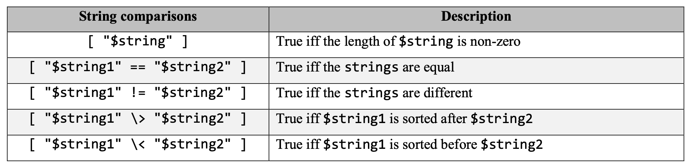
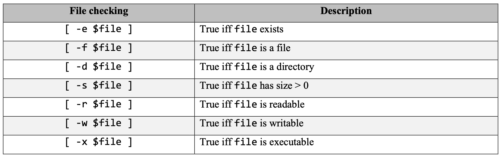
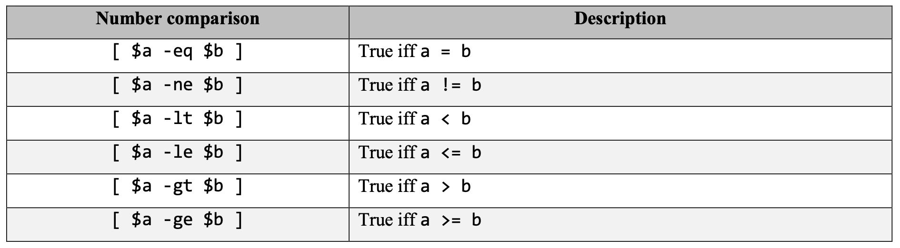

# Shell Script

## Basics

create a shell script: `vi hello.sh`

basic components:
```shell
#!/bin/bash
echo -n "Hello world!" # without trailing newline
```

make the script executable: `chmode u+x hello.sh`

see the location of bash program: `which -a bash`

example for c++:
```shell
#!/bin/bash
g++ add.cpp -o add
./add < input.txt > output.txt
```

execute bash program: `./test.sh`

## Variables

define **(no space!!!)**: `pet="dog"`

access value: `echo $dog`

read user input:
```shell
read name
echo "Hello $name"
```

quotes:
```shell
name="Apple"
echo 'Hello, $name' # Hello, $name
echo "Hello, $name" # Hello, Apple
echo "\$name = $name" # first $ is escaped
```

get output of command: ``
```shell
#!/bin/bash
a="`wc -l file.txt | cut -d\" \" -f1`"
echo "There are $a lines in file.txt"
```

## Strings

return length of string: `${#a}`

get substring **(zero-base)**: `${a:6:3}` string:position:length

replace:
```shell
a="Apple Pie"
new="Juice"
echo ${a/${a:6:3}/$new}
```

mathematical operations: `let`
```shell
a=10
let "b = $a + 9"
echo $b
# + - * / %
```

command line arguments:
|command|meaning|
|:-:|:-:|
|$#|number of arguments|
|$0|script name|
|$n|the n-th argument|

## Flow of Control

### if-else

string comparision:


file/direct checking:


number comparision:


example:
```shell
if [ -e hello.cpp ]
then
    echo "exists"
    g++ hello.cpp -o hello 2> error.txt
    if [ -e hello ]
    then
        ./hello
    else
        echo "Compilation fails"
        echo "Here are the errors"
        cat error.txt
    fi
else
    echo "hello.cpp not found"
fi
```

```shell
if [ ]
then
    # lines
elif
then
    # lines
else
    #lines
fi
```

### for loop

```shell
list="1 2 3 4 5"
for i in $list
do
    echo "$i"
done
```

make file backups:

```shell
#!/bin/bash
list="`ls *.cpp`"
for filename in $list
do
    cp $filename "$filename.backup"
done
```

## Useful Techniques

hide unwanted messages: `cp file123 fileabc 1>/dev/null 2>$1`

output echo message to standard error: `>&2` added after echo and run by `./test.sh 2> error.txt`