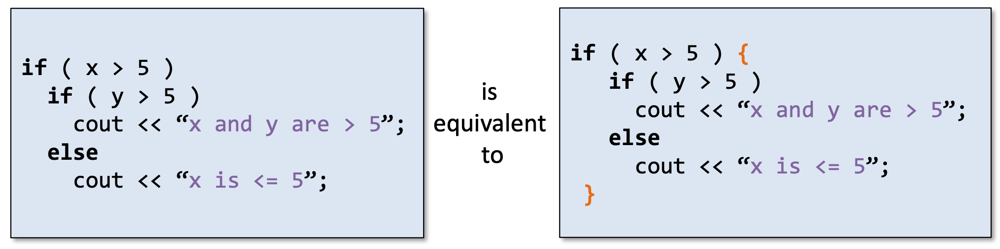

# C++ Basic

```c++
#include<iostream>
using namespace std;

int main(){
    return 0;
}
```

Define variables:
- start with character or _
- case sensitive
- define characters with single quote ' '
- double: 3.14159, 6e23, 1.6e-19
- '\n', '\\', '\?'
- boolean: true, false **(lower case)**
- constant

ASCII A 65 a 97

logical operators: (precedence) ! > && > ||
- !3 = 0; !0 = 1

divide int with int: integer division which returns int

change a letter from upper to lower case: c = c + 'a' - 'A'

++i i++

extraction operator >>: ignores whitespace and stop reading when encountering more

|escape sequence|meaning|
|:-:|:-:|
|\a|alert bell character|
|\b|backspace|
|\n|new line|
|\r|carriage return|
|\t|horizontal tab|
|\v|vertical tab|



`switch` statement
```c++
switch (grade){
    case 'A':
        cout << grade << endl;
        break;
    case 'B':
        cout << grade << endl;
        break;
    default:
        cout << "invalid" << endl;
}
```
```c++
switch (age >= 18){
    case 1:

    case 0:

}
```
```c++
switch (mark/10){
    case 0: case 1: case 2:
    case 3: case 4: case 5:
        cout ...
    case 6:
        cout ...
    default:
        ...
}
```

short hand for if-else: `condition? expr1: expr2`
example: `cout << ( (mark >= 60)? "passed" : "failed" );`

`break` and `continue`