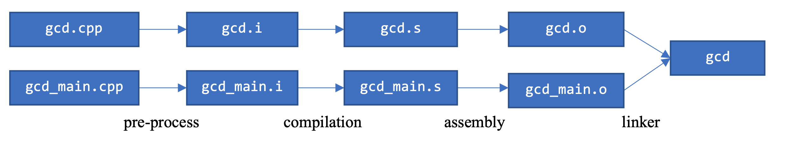
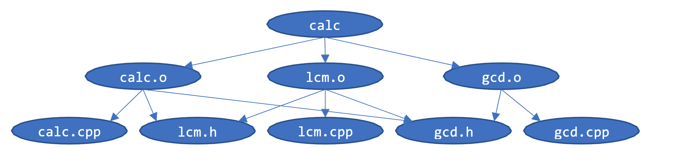

# Makefile

## Compilation

### As Single file

*gcd_single.cpp*

```c++
/// Header
// This program finds the GCD of two numbers as one entire program
#include <iostream>
using namespace std;

/// Function declaration
int gcd(int a, int b);

/// Main program
int main() {
  int a, b, c;
  cout << "Please input two positive numbers: "; cin >> a >> b;
  c = gcd(a, b);
  cout << "GCD is " << c << endl;
}

/// Function definition
// for simplicity, we assume both inputs to be positive
int gcd(int a, int b){
  while(a != b) {
    if (a > b){
      a -= b;} else {
      b -= a; }
  }
  return a;
}
```

### Combine multiple sources

1. Function (include header)

*gcd.cpp*

```c
#include <iostream>
#include "gcd.h" // header file
using namespace std;

int gcd(int a, int b){
  while(a != b) {
    if (a > b){
      a -= b;} else {
      b -= a; }
  }
  return a;
}
```

2. Header (allow others to call the function)

*gcd.h*

```c++
#ifndef GCD_H
#define GCD_H

int gcd(int a, int b);

#endif
```

3. Main program (include header)

*gcd_main.cpp*

```c++
#include <iostream>
#include "gcd.h"
using namespace std;

int main() {
  int a, b, c;
  cout << "Please input two positive numbers: "; cin >> a >> b;
  c = gcd(a, b);
  cout << "GCD is " << c << endl;
}
```

4. Compilation

```c++
g++ -pedantic-errors -std=c++11 gcd_main.cpp gcd.cpp -o gcd
```

### Compilation Process

<br>



Generate object code: (filename.o)

```c++
g++ -c gcd.cpp
g++ -c gcd_main.cpp
```

Link object codes and generate executable program:

```c++
g++ gcd.o gcd_main.o -o gcd
```

### File dependency

<br>



## `make` tool

### Makefile

```c++
gcd.o: gcd.cpp gcd.h
  g++ -c gcd.cpp
```

```
# This file must be named Makefile
# Comments start with #

gcd.o: gcd.cpp gcd.h
	g++ -c gcd.cpp
gcd_main.o: gcd_main.cpp gcd.h
	g++ -c gcd_main.cpp
gcd: gcd.o gcd_main.o
	g++ gcd.o gcd_main.o -o gcd
```

Generate the target:

`make gcd`

### Variables in Makefile

Avoid re-typing same stuff

```
TARGET = gcd
OBJECTS = gcd.o gcd_main.o

$(TARGET): $(OBJECTS)
  g++ $(OBJECTS) -o $(TARGET)
```

`$@`: The target (before :)

`$^`: The dependency list

`$<`: The left-most item in the dependency list

```
gcd_main.o: gcd_main.cpp gcd.h
	g++ -c $<
gcd: gcd.o gcd_main.o
	g++ $^ -o $@
```

### Phony Targets

```
# previous parts snipped

clean:
  rm -f gcd gcd.o gcd_main.o gcd.tgz

tar:
  tar -czvf gcd.tgz *.cpp *.h

.PHONY: clean tar
```

To execute `rm -f gcd gcd.o gcd_main.o gcd.tgz`, just use `make clean`

Complete example of *Makefile*

```
FLAGS = -pedantic-errors -std=c++11

gcd.o: gcd.cpp gcd.h
	g++ $(FLAGS) -c $<

gcd_main.o: gcd_main.cpp gcd.h
	g++ $(FLAGS) -c $<

gcd: gcd.o gcd_main.o
	g++ $(FLAGS) $^ -o $@

clean:
	rm -f gcd gcd.o gcd_main.o gcd.tgz

tar:
	tar -czvf gcd.tgz *.cpp *.h

.PHONY: clean tar
```
