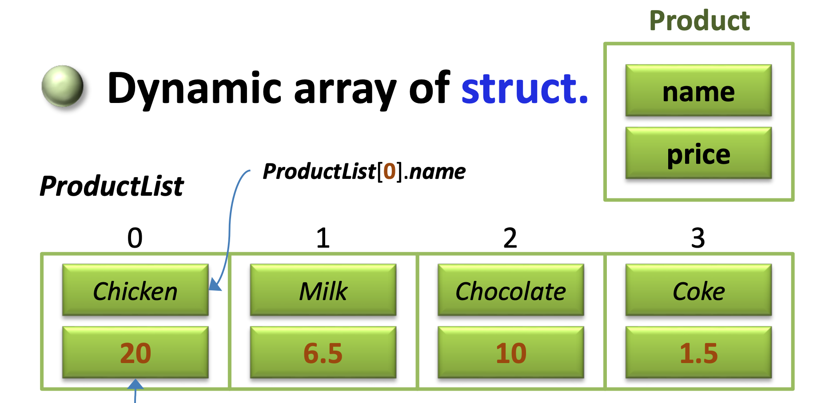
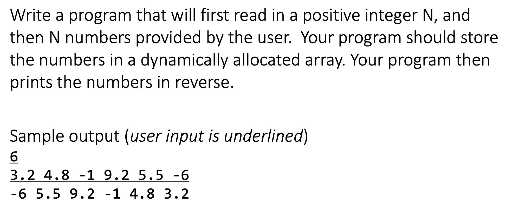
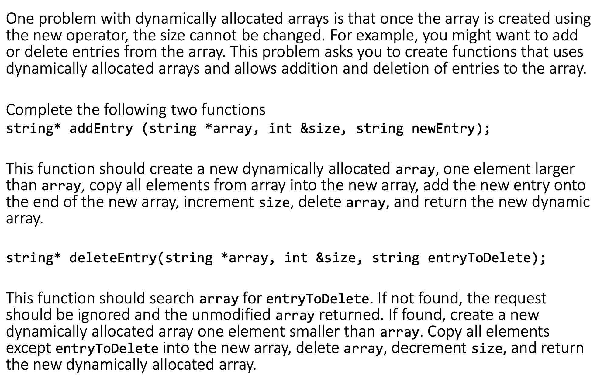

# Pointers

## Memory Address

Address_of operator: `&` to get the address of an operator

eg. `& a` --> 121112

## Pointer variable: stores the address of a variable

Syntax: `type *variable_name` eg. `int *ip`

Can initialize with NULL: `Student *s = NULL`

*(121112) refers to a memory cell

**Type compatibility:** `int` pointer variable can only store the address of an `int` variable

Assign an address to a pointer variable

Valid:
```c++
int x;
int *adr_var;
adr_var = & x;
```

Invalid:
```c++
double x;
int *adr_var;
adr_var = & x;
```

## Dereference a Pointer

Declaration: `* adr_var`

Assignment: `adr_var = &x`

Dereference: `cout << * adr_var << endl` // print the value of x

## Pointer and Struct and Class

`a->b` = `(*a).b`

## Dynamic variable

keyword `new`: in tree store

```c++
int main(){
  int *p;
  string *s;

  p = new int;
  s = new string;

  *p = 8;
  *s = "dragon";

  return 0;
}
```

## Pointers and functions

Example: Swap

```c++
void swap(int *x, int *y){
  int temp = *x;
  *x = *y;
  *y = temp;
}

int main(){
  int a = 2, b = 5;
  swap(&a, &b);
  cout << a << "" << b;
}
```

## Pointers and arrays

When referring to an array, the pointer stores the address of the 1st slot of the array.

Use `*(p+n)` or `p[n]` to indicate later slots.

# Dynamic Array

## Dynamic Array of Struct

<br>



```c++
struct Product{
  string name;
  string price;
};

Product *productList;
productList = new Product[4];
```

Get "Chicken": `productList[0].name`

### `nothrow`

When defining large dynamic array: `Student * S = new (nothrow) Student[10000]`

### Search

```++
void search(Product *productList, string searchName){
  for (int i=0; i<4; i++){
    if ( productList[i].name == searchName )
      cout << Product[i],name << endl;
  }
}
```

### Insertion

1. Create a temporary array to store a copy of original array

```c++
int size = 4;
Product *temp;
temp = new Product[size];
for (i=0; i<size; ++i){
  temp[i] = productList[i];
}
```

2. Delete the original productList

```c++
delete [] productList;
```

3. Recreate a larger productList and copy value from temp and delete it

```c++
productList = new Product[size+1];
for (i=0; i<size; ++i){
  productList[i] = temp[i];
}

delete [] temp;
```

4. Add the new element (remember to increase the size)

```c++
productList[size].name = "Candy";
productList[size].price = 2.5;
size++;
```

### Deletion

Methodology: move all later elements one slot before

```c++
// slotID: the index of the element to be deleted
void delete_product(Product *productList, int slotID, int size){
  for (i=slotID; i<size; ++i){
    productList[i] = productList[i+1];
  }
}
```

# Linked List

```c++
struct Product{
  string name;
  double price;
  Product *next;
}
```

## Declaration

```c++
Product *head = NULL;
```

## Insertion

### Insert after the head

```c++
Product * headInsert(Product *h, string n, double p){
  // create a new node
  Product *pNode = new Product;
  // Assign values
  pNode->name = n;
  pNode->price = p;
  // the new node's next is the original first node
  pNode->next = h; // the address of the first node, held by header
  // head points to the new node
  h = pNode;
  return h;
}
```

## Search

```c++
void searchList(Product *head, string n){
  // create a pointer current
  Product *current;
  current = head;
  while (current != NULL){
    if (current->name == n)
      cout << current->price << endl;
    current = current->next;
  }
}
```

## Deletion

```c++
// Create 2 pointers current and previous
Product *current, *previous;
previous = NULL;
current = head;

// search the element to be deleted, point the previous node to the next node
while (current != NULL){

  if (current->name == "Chicken"){
    previous->next = current->next;
    delete current;
    break;
  }

  previous = current;
  current = current->next;
}
```

# Review Exercises

1. What is the output of the following program?

*Problem1.cpp*

```c++
#include <iostream>
using namespace std;

int main(){
  int i1, i2;
  int *p1 = &i1, *p2 = &i2;
  *p1 = 10;
  *p2 = 20;
  cout << *p1 << " " << *p2 << endl;
  p1 = p2;
  cout << *p1 << " " << *p2 << endl;
  *p1 = 30;
  cout << *p1 << " " << *p2 << endl;
}
```

Output:
10 20
20 20
30 30

if the line 9 `p1 = p2` is replaced by `*p1=*p2`:
10 20
20 20
30 20

2. What might be the misinterpretation from the following declaration?

`int* ptr1, ptr2;`

whether ptr2 is also a pointer

3. 

*Problem3.cpp*

```c++
#include <iostream>
using namespace std;

int main(){

  int n;
  double num;
  cin >> n;

  double *numList;
  numList = new double[n];

  for (int i=0; i<n; ++i){
    cin >> num;
    numList[i] = num;
  }

  for (int i=n-1; i>=0; --i){
    cout << numList[i] << endl;
  }
}
```

4. 

*Problem4.cpp*

写不出了！！！！
