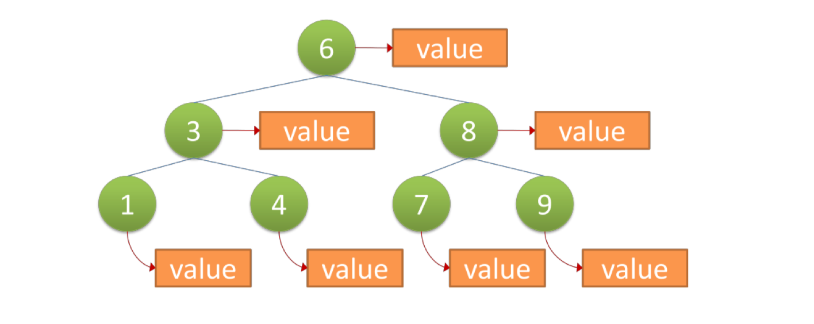
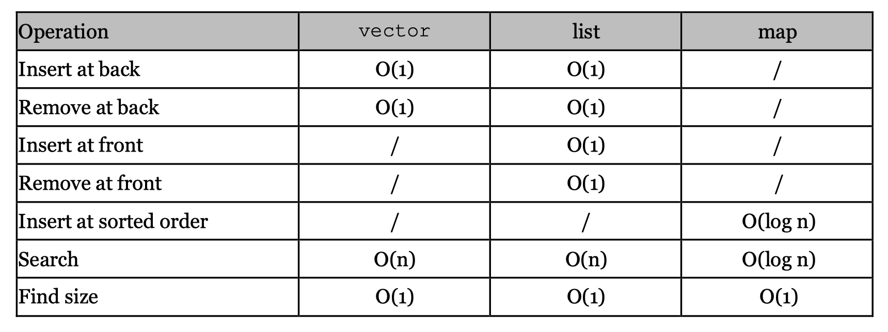
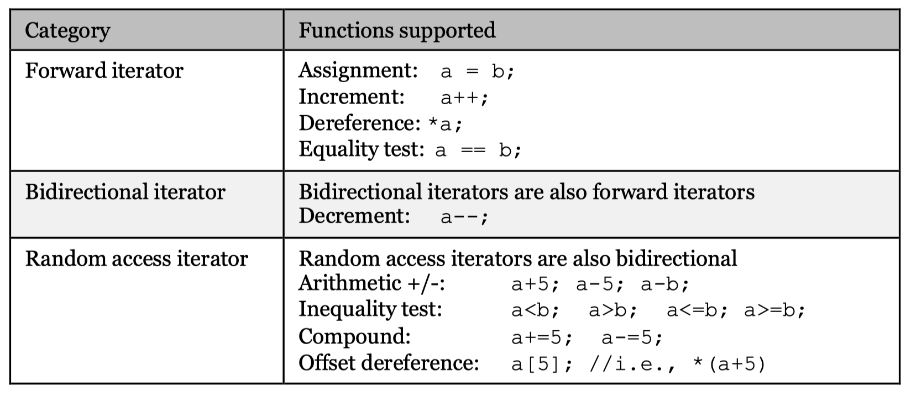

# Standard Template Library (STL)

1. Containers: classes for storing data, eg. linked lists and sets
2. Iterators: classes for accessing items in Containers
3. Algorithms: common algorithms, eg. sorting, searching

## Containers

### Vectors

Four main functions:

1. `v.push_back(type item)`: add an item to the end
2. `v.size()`: return size
3. `v[i]`: access the index-th item in the vector
4. `v.pop_back()`: remove the last item
5. `=`: v1.size() = v2.size(); v1[i] = v2[i]

example: maintain a phone book

```c++
#include <iostream>
#include <string>
#include <vector>
using namespace std;

int main(){
  vector<string> names; // create an empty vector of string
  vector<int> numbers;

  string command, name; int number;
  while (cin >> command >> name) {
    if (command == "Add"){
      cin >> number;
      names.push_back(name);
      numbers.push_back(number);
    }
    else { // command == Search
      for (int i=0; i<names.size(); i++)
        if (names[i] == name)
          cout << numbers[i];
    }
  }
}
```

#### Vectors of user-defined classes

```c++
#include <iostream>
#include <string>
#include <vector>
using namespace std;

class Record {
public:
  string name;
  int number;
};

// same as
// struct Record{
//   string name;
//   int number;
// }

int main(){
  vector<Record> book;
  string command; Record r;

  while (cin >> command >> r.name){
    if (command == "Add"){
      cin >> r.number;
      book.push_back(r);
    }
    else{
      for (int i=0; i<book.size(); ++i){
        if (book[i].name == r.name){
          cout << book[i].number;
        }
      }
    }
  }
}
```

**pass by value:** However, when an element is added to the vector, a copy of it is created and added. So if the value of the element changes afterwards, it does not affect the copy in the vector.


### Lists

1. `l.push_back(type item)`: add an item to the back
2. `l.pop_back()`
3. `l.front()`: access the first item
4. `l.back()`: last item
5. `l.push_front(type item)`: add an item to the front
6. `l.pop_front()`
7. `l.size()`
8. `=`

**no efficient access the i-th item:** `list[i]` is invalid

```c++
#include <iostream>
#include <string>
#include <list>
using namespace std;

int main() {
  list<string> names; //create a list of strings
  list<int> numbers;

  string command, name; int number;

  while (cin >> command >> name) {
    if (command == "Add") {
      cin >> number;
      names.push_back(name); //insert a string to the end numbers.push_back(number);
    }
    else {
      for (int i = 0; i < names.size(); i++){
        if (names.front() == name)
          cout << numbers.front(); //access first string
        else { // move the item searched to the front and print
          names.push_back(names.front());
          names.pop_front();
          numbers.push_back(numbers.front());
          numbers.pop_front();
        }
      }
    }
  }
}
```

#### List of user-defined classes      

```c++
#include <iostream>
#include <string>
#include <list>
using namespace std;

class Record {
public:
  string name;
  int number; };

int main() {
  list<Record> book; //create a list of Records
  string command; Record r;

  while (cin >> command >> r.name){
    if (command == "Add") {
      cin >> r.number;
      book.push_back(r);
    } else {
      for (int i = 0; i < book.size(); i++){
        if (book.front().name == r.name) {
          cout << book.front().number;
          break;
        } else {
          book.push_back(book.front());
          book.pop_front(); }
      }
    }
  }
}
```

### Maps

Using vectors or lists to implement a phone book, adding a record takes O(1) and searching takes O(n) of time, where n is the size of the phone book.

Maps facilitate searching: O(log n)



**Each branch two nodes, left < right.**

- `map<k, v> m`: create a map such that each pair in m has key of type k and value of type v

- `map[key]`: access the corresponding value

If key does not exist, create a pair with the key and the default value (eg. type int generates an arbitrary integer)

- `int count(key)`: 1 if exists, check existence

- `int size()`

```c++
#include <iostream>
#include <string>
#include <map>
using namespace std;

int main(){
  map<string, int> book;
  string command, name; int number;

  while (cin >> command >> name){
    if (command == "Add"){
      cin >> number;
      book[name] = number;
    }
    else {
      if (book.count(name) > 0)
       cout << book[name];
      else
        cout << "Name not found" << endl;
    }
  }
}
```

#### Map of user-defined classes

The following program will have **compilation error**!

```c++
#include <iostream>
#include <string>
#include <map>
using namespace std;

class Record {
public:
  string name;
  int number;
}

int main(){
  map<Record, int> book;
  string command; Record r;
  while (cin >> command >> r.name){
    if (command == "Add"){
      cin >> r.number;
      book[r] = r.number;
    }
    else {
      if (book.count(r) > 0)
        cout << book[r];
      else
        cout << "Not found" << endl;
    }
  }
}
```

Error because maps require **keys to have an ascending order**.

To solve the problem: (define the comparison standard)

```c++
bool operator(const Record& a, const Record& b){
  return a.name < b.name;
}
```




## Iterators

Items in containers can be accessed by iterators.

### Declare an iterator

```c++
vector<string>::iterator itr;
list<int>::iterator itr2;
```

### Access the first item

```c++
vector<int> v;
v.push_back(3);
v.push_back(4);
v.push_back(5); // now v = [3,4,5]

vector<int>::iterator itrOfV = v.begin() // point to the first item in v
*itrOfV = 100; // dereference itrOfV, change 3 to 100
cout << *itrOfV << endl; // print 100
```

### Move the iterators

```c++
vector<int>::iterator itr = v.begin();
for (int i=0; i<v.size(); i++) {
  cout << *itr << " ";
}
// print 100 4 5
```

### Arrive at the end

```c++
vector<int>::iterator itr2;
for (itr2 = v.begin(); itr2!=v.end(); itr2++)
  cout << *itr2 << ' '
```

### Print a map

```c++
#include <iostream>
#include <map>
using namespace std;

int main(){
  map<int, double> input;
  for (int i=0; i<5; i++)
    input[i*3%5] = i+0.1;

  map<int, double>:: iterator itr;
  for (itr = input.begin(); itr != input.end(); itr++)
    cout << (*itr).first << ' ' << (*itr).second << endl;
}
//().first accesses the key, ().second accesses the value
```




Vector iterators: random access iterators
List and Map iterators: bidirectional iterators

### Iterators and Pointers

Pointers: memory address
Iterators: stores information of the item it points to


## Algorithms

`#include <algorithm>`

### Sort

```c++
void sort(RandomAccessIterator first,
  RandomAccessIterator last);
```

example: sort a vector of strings

```c++
vector<string> input;
//define the vector 略
sort(input.begin(), input.end());
```

We can also sort only a certain range of the vector

`sort(input.begin()+1, input.end()-1)`

### Sort array

Here, the array name `input` is a constant pointer pointing to the first item, and input+10 points to input[10] (unreal)

```c++
int input[10];
// define the array 略
sort(input, input + 10);
```

### Sort user-defined classes

```c++
class Email{
public:
  string sender;
  string subject;
};
```

Error:

```c++
vector<Email> v;
sort(v.begin(), v.end());
```

Unless:

```c++
bool operator <(const Email& a, const Email& b){
  if (a.sender < b.sender) return true;
  if (a.sender > b.sender) return false;
  return a.subject.size() < b.subject.size();
}
